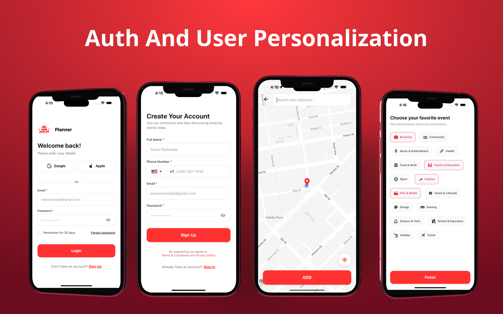

# Planner - Premium Event Discovery & Tracking

Planner is a high-performance event discovery application built with React Native and Expo. It transforms how users discover, join, and manage events through a modern, card-based interface, interactive mapping, and real-time community engagement.

## Visual Experience

### 1. Welcome & Onboarding
Planner greets users with a sleek, vibrant onboarding experience that sets the tone for a premium event-tracking journey.


### 2. Secure Authentication
Seamless login and signup flows powered by Supabase Auth, ensuring user data is secure from the first step.



### 3. Dynamic Dashboard
A data-driven home screen featuring categorized horizontal carousels, upcoming events, and popular activities happening around you.


### 4. Interactive Discovery Map & Search
A custom Google Map implementation featuring category-aware pill markers and a horizontal event carousel. High-end search filters allow users to narrow down events by date, category, and price.


### 5. Event Creation
Users can easily create and host their own events with integrated location picking and category selection.


### 6. Real-time Community Chat
Each event features an instant real-time group chat leveraging Supabase Channels, allowing participants to coordinate and connect instantly.


### 7. Ticket Management
Keep track of your upcoming and past events with a clean, summarized ticket history.


### 8. User Profiles
Personalized profiles that showcase user interests, event history, and social connections.


---

## Technical Architecture

The project follows a strict **Clean Architecture** (Feature-Sliced Design) to ensure maximum scalability and maintainability.

### Core Structure
- **Core:** Global state management (Zustand), Supabase client initialization, and navigation configurations.
- **Shared:** Reusable UI components (PrimaryButton, CustomInput), theme tokens (Colors, Typography), and responsive utilities.
- **Features:** Modularized slices (Auth, Events, Map, Messaging, etc.) containing their own logic, presentation components, and hooks.

### State Management
We use **Zustand** for lightweight, high-performance state management, combined with middleware for persisting user authentication and application preferences.

---

## Supabase Integration & Real-time Connectivity

Planner leverages **Supabase** as its primary backend infrastructure.

### Authentication & Profiles
Managed via `AuthService` and `ProfileService`, coordinating secure sign-up, session management, and profile persistence. User attributes like interests and locations are synced in real-time.

### Real-time Chatting
The messaging system utilizes **Supabase Realtime (Channels)**. 
- **Broadcast:** Instant delivery of messages to all active participants in an event group.
- **Persistence:** Messages are stored in the database for historical retrieval.

---

## Getting Started

### Prerequisites
- Node.js & npm
- Expo Go app or a physical device simulator
- Supabase account

### Environment Setup
Create a `.env` file in the root directory:
```env
EXPO_PUBLIC_SUPABASE_URL=your_supabase_url
EXPO_PUBLIC_SUPABASE_ANON_KEY=your_supabase_anon_key
```

### Installation
1. Install dependencies:
   ```bash
   npm install
   ```
2. Start the development server:
   ```bash
   npx expo start
   ```

---

## Open Source & Contributions
Planner is an open-source project. Feel free to contribute by opening issues or submitting pull requests focused on improving the event discovery experience.
